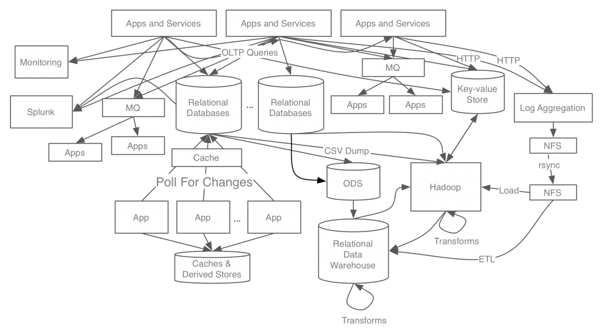
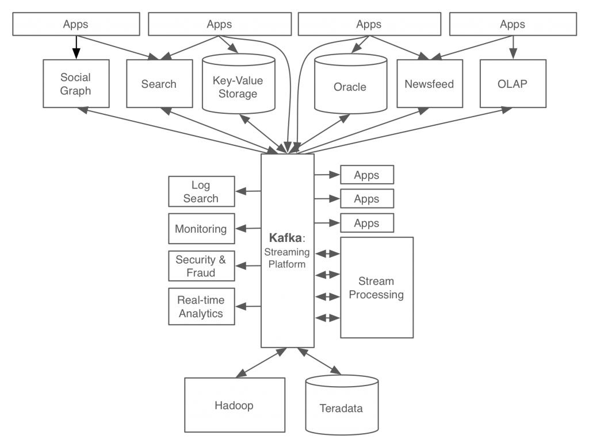

# Kafka

## Why use

MSA 구조에서 실시간으로 안정적이고 빠른 데이터 통신을 하기 위해.

애플리케이션간의 Data flow를 간단하게 하기 위해.

|       without Kafka        |         with Kafka         |
| :------------------------: | :------------------------: |
|  |  |

## References

- https://www.confluent.io/blog/event-streaming-platform-1/
